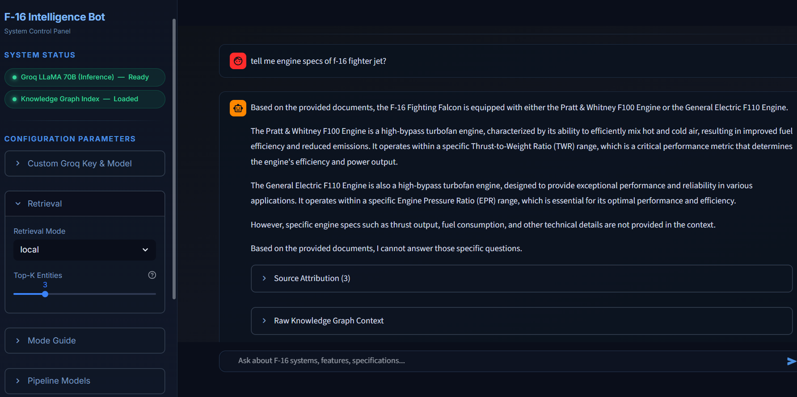
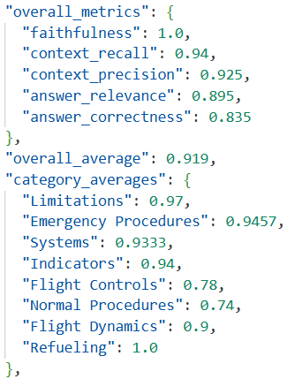

# F-16 Defence Intelligence Bot

**Knowledge Graph RAG (KG-RAG)** for high-precision technical retrieval. Built for fast, multi-hop reasoning over complex aerospace documentation.

Uses **Groq** for fast inference, **Qdrant Cloud** for vector storage, and **Neo4j Aura** for the Knowledge Graph.

---

## System Demo

### User Interface


### Video Walkthrough


---

## Quick Start

```bash
pip install -r requirements.txt
cp .env.example .env          # Fill in Qdrant, Neo4j, Groq credentials
python build_index.py --docs ./Docs
streamlit run app.py
```

---

## Architecture

```
[Build — local, once]
./Docs → extractor.py → chunks → Groq 8B (entity extraction) → Neo4j Aura
                                → HF nomic-embed (768d)       → Qdrant Cloud

[Inference — Production]
Query → LightRAG(only_need_context=True) → Qdrant + Neo4j → raw_ctx
raw_ctx → Groq 70B (streaming) → Answer + Source Attribution
```

---

## Tech Stack

| Component | Technology |
|---|---|
| **RAG Framework** | LightRAG (Graph + Vector) |
| **Inference Engine** | Groq LPU™ (Llama-3.3-70B) |
| **Graph Database** | Neo4j Aura (Cloud) |
| **Vector Store** | Qdrant Cloud (GCP) |
| **Embeddings** | Nomic-Embed-Text-v1.5 |
| **Frontend** | Streamlit (Custom UI) |

---

## Evaluation Results

Performance validated against ground-truth Q&A pairs from F-16 technical manual.



| Metric | Result |
|---|---|
| **Faithfulness** | **100%** |
| **Context Recall** | **94.0%** |
| **Context Precision** | **92.5%** |
| **Answer Relevance** | **89.5%** |
| **Answer Correctness**| **83.5%** |

---

## License

MIT